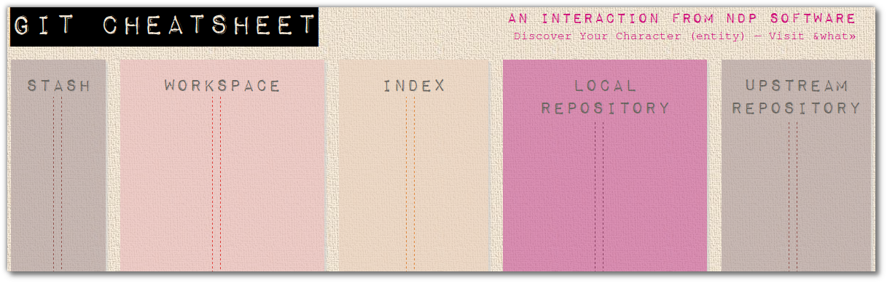

<link href="index.css" rel="stylesheet" type="text/css">

# <a id="chapter7">The local git workflow</a>

To recap, we have our working copy of our files on our laptop.  When we add those files using git, a copy is placed in what git calls Staging.  This allows you to assemble several files for the commit.

As we have a local repository right there on our laptop, we can commit all the files added to the staging area.  If you can add a series of small commits and do this often, it gives you a more detaled version history and gives you more points to jump back in time.  Regular commits helps to reduce merge conflicts when working in teams and using smaller commits gives other developers lots of details about how the project has evolved.

In this visual representation you can see the different git stages in which commits can reside.

## Understanding git add and the staging area

When you add a file, you are telling git that you want it to be part of the change you are going to commit.

Lets say you create a new file with 10 lines of content and then use *git add filenname.ext* to add it to git.  Then you continue to add another 5 lines the contents of that file.  If you do a commit without adding that file to git again, only the first 10 lines of content will be in that commit.

If you do a second *git add filenname.ext* before you commit, then all 15 lines of content will be included in the commit.

Having to add changes in this way helps you control exactly what makes up your commit without restricting the files you are working on.  Please note that it is advisable to either git add & git commit often so that your changes form part of a meaningful history.

## What has been added - What has changed (using diff)

Once you have added files to the staging area with *git add*, you can compare any changes made to files in your workspace.  Using git diff you can see all changes or specifying a file will show only the differences in that one file.

    git diff
    git diff filename

You can also compare the files you have added to the staging area to those you have committed using the diff option *--staging*

    git diff --staging
    git diff --staging filename

## Removing files from staging / index

You can remove a file you have put in staging (git add filename) using the git command reset

    git reset --soft HEAD^

rolling back to the previous commit on the local repo
    git reset HEAD~1

## To remove a file from the index

    git rm --cached filename.txt

[Back to top...](#top)

[Workshop homepage](index.html)
